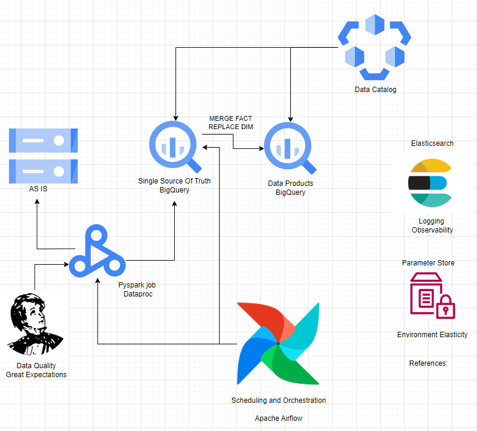
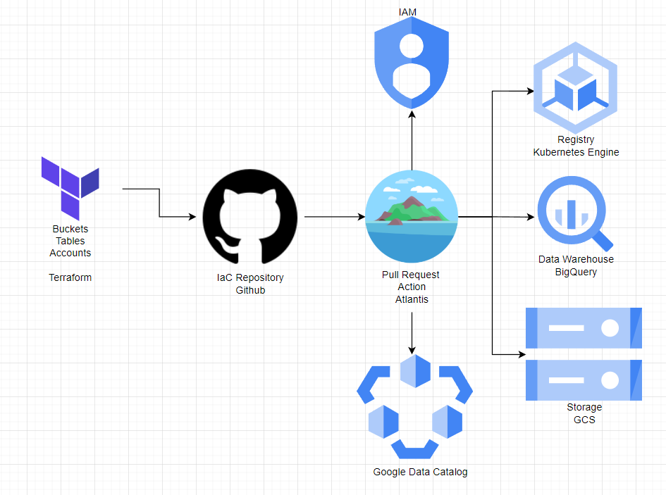
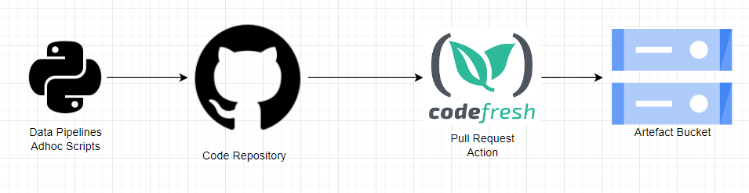

# AB Inbev Sales Pipeline

Consistis of a python class built with a workflow that translates the bussiness rules.

## Dependencies

First step to run this locally is to assure that que requirements are installed, you can do this by running the following command: 

```python -m pip install -r requirements.txt```

Another step for running this locally is to explicitly use a service account key (json) exporting it to your OS via script.
The CREDENTIALS constant represents a valid path to the credential keys: 

```os.environ["GOOGLE_APPLICATION_CREDENTIALS"] = CREDENTIALS```

Other dependencies are the .jar files from the connectors used with Google Cloud Platform, if you want to run this locally i may provide those jars to your spark session. You can find these dependancies here: [Github](https://github.com/GoogleCloudDataproc). The needed jars bellow: 

```>> spark-3.3-bigquery-0.32.0.jar```

```>> gcs-connector-hadoop3-2.2.16-shaded.jar```

To explicitly instantiate your dependacies on the spark session, add these options to it:

```.config("spark.jars",f"{JARS_PATH}/{BIG_QUERY_JAR},{JARS_PATH}/{GCS_JAR}") \
.config("spark.hadoop.fs.gs.impl","com.google.cloud.hadoop.fs.gcs.GoogleHadoopFileSystem") \
.config("spark.hadoop.google.cloud.auth.service.account.json.keyfile",CREDENTIALS) \
.getOrCreate()
```

Remenber that all constants represents a valid path

## Running the Pipeline

To run this pipeline over Dataproc (GCP Managed Hadoop Service) just submit the main.py with a valid  ```--logical-date YYYYMMDD``` argument, it is the interface between the script and the first part of the ETL, its extraction, logical date makes the script extract only files with the logical date on its suffix. 

To do this locally you can run the command bellow: 

```python3 main.py --logical-date YYYYMMDD```

The workflow of the pipeline consists of the following methods: 

```stage()```: Extract Raw data from Google Cloud Storage Bucket, merge (Sales and Channels) , apply treating transformations and persists Dataframe on temporary table on BigQuery.

```ssot()```: Run a MERGE statement query between Stage and Single Source of Truth, bringing UPDATES and INSERTS on BigQuery.

```warehouse()```: Run the Dimensions and Fact queries on BigQuery.

## Data Model:


## Future Further Steps: 

### Architecture



### Infrastructure as Code 



### CICD


